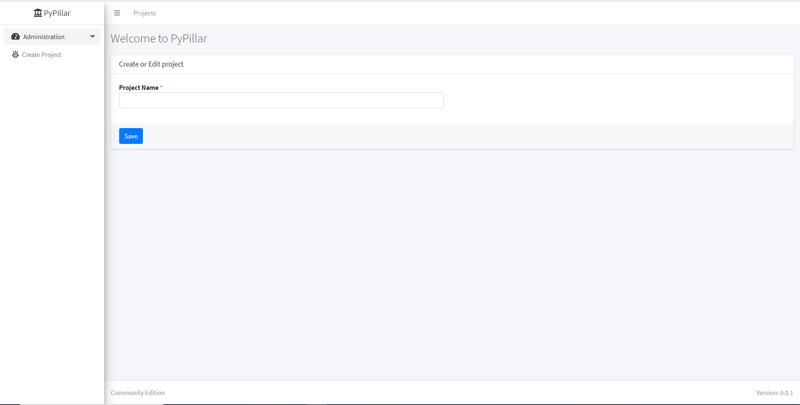
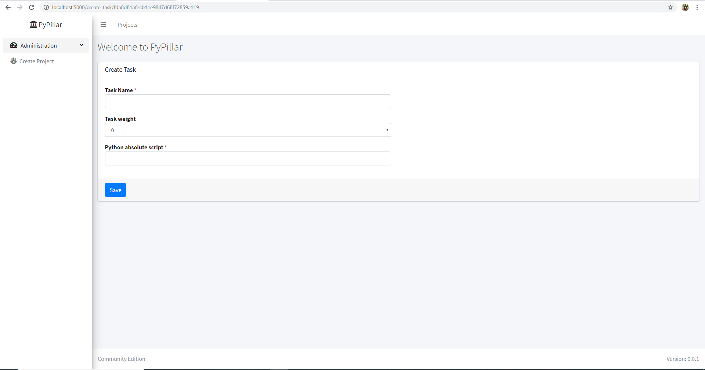
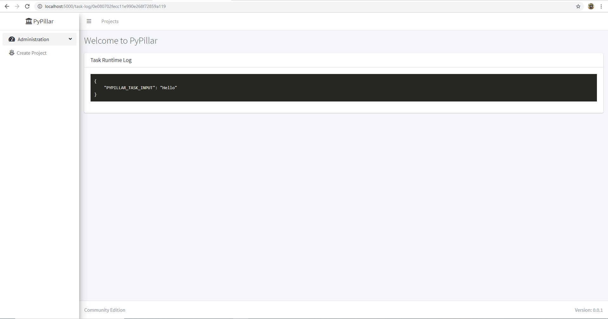
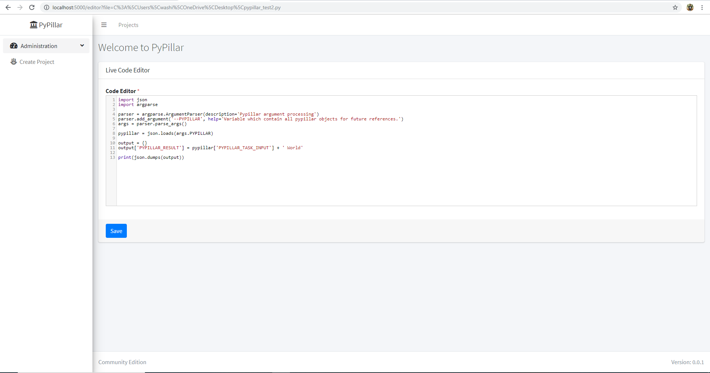
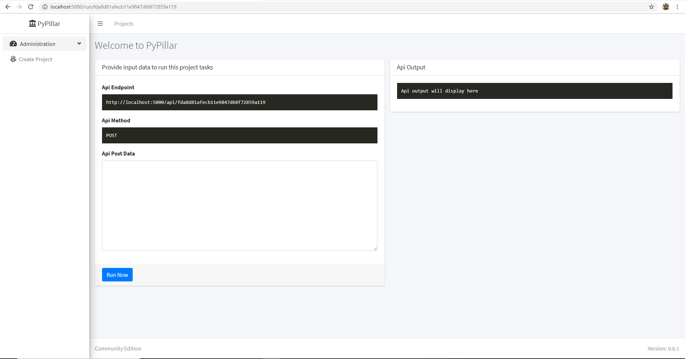
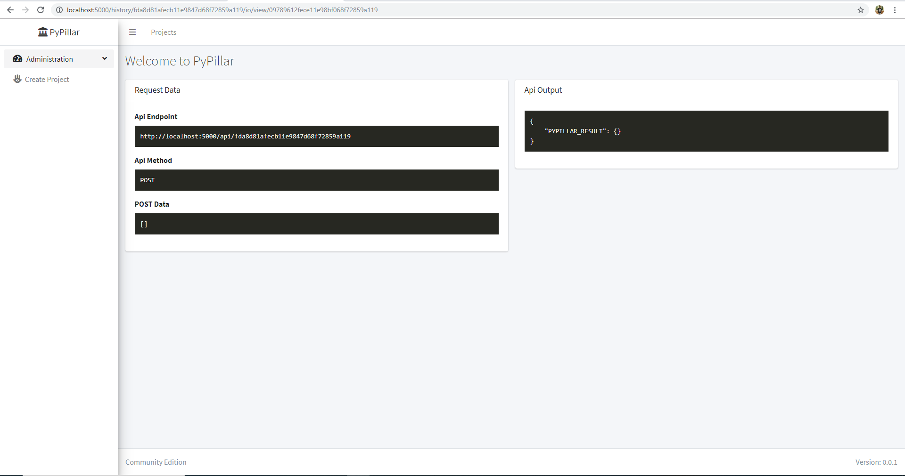

Welcome to PyPillar's documentation!
====================================
This is an open source REST tool which allow to run any python script as a distributed task to monitor its all events during execution.

.. toctree::
   :maxdepth: 2
   :caption: Contents:

Why PyPillar
====================================
This is an open source REST tool which allow to run any python script as a distributed task to monitor its all events during execution.

#. Priceless and its free
#. Distribute your large python script in several task
#. Monitor task logs
#. Investigate python task exception.
#. Investigate requests history in future at any point of time.
#. Create multiple projects.
#. Live code editor which allow to change code associated with task.
#. Quickly and easily run REST to test the REST api.

Installation
=====================================
.. code-block:: shell

    pip install pypillar

Start Server
=====================================
To start PyPillar server run below command in terminal

.. code-block:: shell
   pypillar run

It will expose the server in http://localhost:5000

PyPillar Runtime Objects
=====================================
To get PyPillar runtime objects inside your task python script include below code snippets just beginning of your python script.

.. code-block:: python

   import json
   import argparse

   parser = argparse.ArgumentParser(description='Pypillar argument processing')
   parser.add_argument('--PYPILLAR', help='Variable which contain all pypillar objects for future references.')
   args = parser.parse_args()

   pypillar = json.loads(args.PYPILLAR) # This variable contaion all the information
   print(json.dumps(pypillar)) # Dump the variable and debug in PyPillar Task logger.

PyPillar Runtime Task Input
=====================================
Suppose you want to pass transformed input from Task1 to Task2 and finnaly you want result then below is the example.

.. code-block:: python

   # Task1 python script
   import json
   var = {}
   var['PYPILLAR_TASK_INPUT'] = 'Hello'
   print(json.dumps(var))

.. code-block:: python

   # Task2 python script
   import json
   from pypillar.common import runtime_objects
   pypillar = runtime_objects()
   output = {}
   output['PYPILLAR_RESULT'] = pypillar['PYPILLAR_TASK_INPUT'] + ' World'
   print(json.dumps(output))

It will give following result

.. code-block:: json

   {
      "PYPILLAR_RESULT": "Hello World"
   }

Some Screenshot
=====================================

